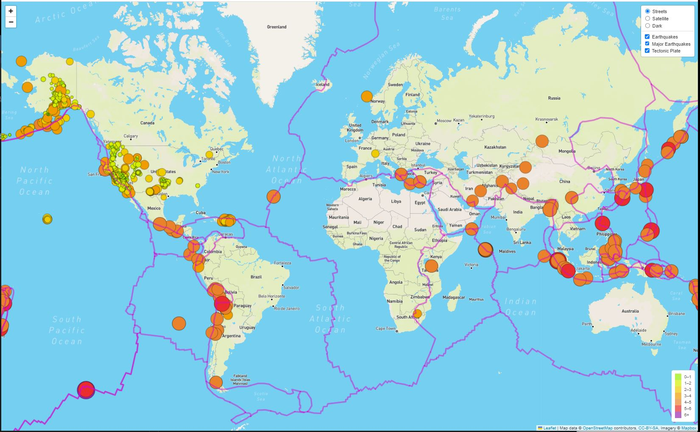

# Mapping Earthquakes
Using Leaflet and Mapbox, we created a web app to display global earthquake information using GeoJSON data we retrieved from the U.S. Geological Survey website.

Our web app has three base map options (Streets, Satellite, Dark). In addition, there are three optional earthquake information layers users can select to add to the base map (Earthquakes, Major Earthquakes, Tectonic Plate)

## Sample Web App Output:

