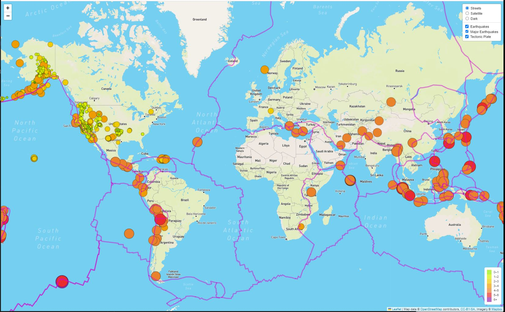

# Mapping Earthquakes
Using Leaflet and Mapbox, we created a web-app to display global earthquake information using GeoJSON data we retrieve from the U.S. Geological Survey website.

Our web-app has three base map options (Streets, Satellite, Dark). 
In addition, there are three optional earthquake information layers user can select to add onto the base map (Earthquakes, Major Earthquakes, Tectontic Plate)

## Sample Web App Output:

